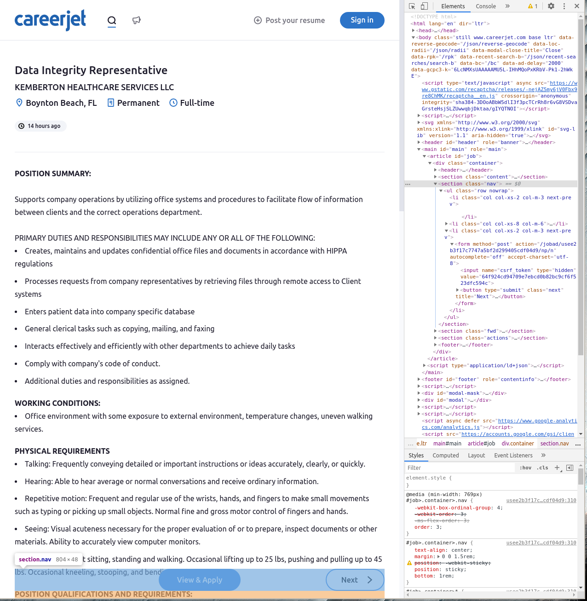
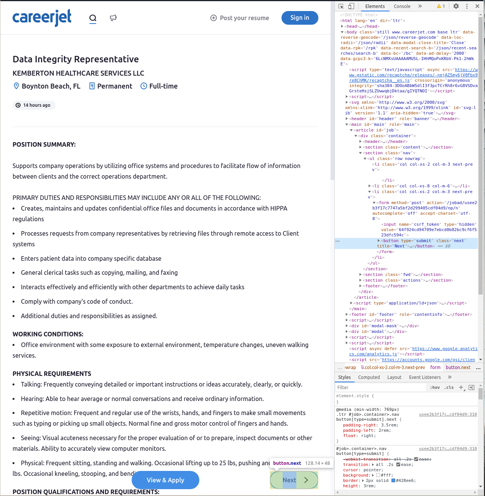

## What You Will Learn

Do you want to do some natural language processing on job postings and need data?
I did about a month ago when I was starting my capstone [project](https://github.com/sethchart/JobDash) for my Data Science bootcamp at Flatiron school.
I found that [careerjet.com](https://careerjet.com) had fairly straightforward web design and over three million job postings in the United States, a great candidate for web scraping! In this post, I will describe my approach to scraping careerjet.com and outline a few approaches that did not workout for me.
Hopefully, I can jump-start your NLP project on on job postings by letting you skip a few of my missteps.

## My Approach
After trying a few other approaches I decided to use [Selenium](https://pypi.org/project/selenium/) to interact with careerjet.com.
I found that this gave me access to 10,000 job postings, which was substantially more than other approaches.

The workflow is simple. 
 1. Open an Chrome browser, load the first page of search results on careerjet.com, then click on the first job listing to load the first job posting.
 2. Read the job title, url, and job description from the job posting page.
 3. If the next page button is available, click it to load the next job posting. Otherwise, stop scraping.

## Investigating Site Structure

In order to implement the scraping workflow, I needed to find a few key elements in the source code of careerjet.com.
 1. The url for the first job posting in the first page of search results.
 2. The job title on a job posting page.
 3. The job description on a job posting page.
 4. The next button on a job posting page.

The great thing about careerjet.com as a data source is that all of these elements are easy to access.
 I located all of the elements above using Chrome [developer tools](https://developers.google.com/web/tools/chrome-devtools). 
Below I give a quick example of locating the next button using developer tools. All of the other elements listed above were located in a similar way.

### Locating an element

The trickiest element to access was the next button.
After, some experimentation I found that is was best to first locate the navigation bar and then locate the next button inside the navigation bar. The benefit of this approach is that the navigation bar is present even when the site does not have a next page to serve. Locating the navigation bar and then checking for the next button makes it easier to manage the no next page issue when we automate.

To locate an element first open developer tools on the page in question (press F12) then activate the selector tool (pressCtrl + Shift + C) and hover over the element you wish to locate.

#### Locating the Navigation Bar

In the screenshot below you can see that the navigation bar is a `section` element with the class `nav`. 



#### Locating the Next Button

In the screenshot below you can see that the next page button is a `button` element with the class `next`.



## Implementation

To automate the web scraping workflow I decided to design a class that wraps a Selenium web driver and provides methods for each of the steps in the workflow.
Then I can simply instantiate a object and use its methods to execute the workflow in a simple script.

### Step 1

The `__init__` method from our class runs when we instantiate an object. It executes the following actions to achieve the first step of our workflow. 
 1. Open a Chrome browser that is controlled by the Selenium web driver and assign it to the browser attribute.
 2. Use the open browser to open the careerjet search page with location pre-filled with `USA` and search pre-filled with `data`. The pre-filling is achieved by passing the [query string](https://en.wikipedia.org/wiki/Query_string) `l=USA&s=data` at the end of the url.
 3. Find the first job listing on the search results page. This is achieved by finding the first element on the page with the class `job`.
 4. Find the link to the full job posting within the job listing element. Each job listing has one link, which is to the full job posting, so we achieve this by selecting the anchor tag from the job listing element.
 5. Click on the link using the `click` method from Selenium.

```python

def __init__(self):
    """__init__. Opens a new browser with the first page of creerjet search results.
    Then, clicks on the first job posting. Once this method has run, the
    Driver object is ready to scrape the first job listing.
    """
    self.browser = webdriver.Chrome()
    self.browser.get('https://www.careerjet.com/search/jobs?l=USA&s=data')
    first_job_posting = self.browser.find_element_by_class_name('job')
    first_job_link = first_job_posting.find_element_by_tag_name('a')
    first_job_link.click()
```

### Step 2
Scraping data from the job posting is handled by the `scrape_page` method. There are four major actions that occur.
 1. Use the `_get_current_page_soup` class method to load the source code of the current job posting page as a BeautifulSoup object. 
 2. Use the `_get_title` class method to extract the job title from the soup.
 3. Use the `current_url` Selenium method to get the url of the current job posting page.
 4. Use the `_get_description` method to extract the job description from the soup. 


```python
def scrape_page(self):
    """scrape_page. Scrapes the current job posting and returns a
    dictionary containing job title, job description, and url.
    """
    soup = self._get_current_page_soup()
    page_data = {
        'title': self._get_title(soup),
        'url': self.browser.current_url,
        'description': self._get_description(soup)
    }
    return page_data
```

The `scrape_page` method uses the `_get_current_page_soup`, `_get_title`, and `_get_description` methods, which we display below for the interested reader. Each one wraps some simple actions using BeautifulSoup.

```python
def _get_current_page_soup(self):
    """_get_current_page_soup. Extracts html source code for current job
    posting and returns BeautifulSoup object for further manipulation.
    """
    page = self.browser.page_source
    soup = BeautifulSoup(page, 'html.parser')
    return soup
```
```python
@staticmethod
def _get_title(soup):
    """_get_title. Extracts the job title from the current posting.

    Parameters
    ----------
    soup : bs4.BeautifulSoup
        BeautifulSoup object containing the contents of the current job
        posting page. Takes output from _get_current_page_soup.
    """
    title = soup.find('h1').text
    return title
```
```python
@staticmethod
def _get_description(soup):
    """_get_description. Extracts the description from the current
    posting.

    Parameters
    ----------
    soup : bs4.BeautifulSoup
        BeautifulSoup object containing the contents of the current job
        posting page. Takes output from _get_current_page_soup.
    """
    description = soup.find('section', class_='content').text
    return description
```

### Step 3

Advancing to the next page is handled by the `next_page` method which executes the following actions.
 1. Find the navigation bar.
 2. Find the next page button within the navigation bar.
 3. Get the url of the current page.
 4. Click on the next page button.
 5. Wait for the url of the current page to change before releasing control of the browser.

Note that, Step 5 is very important because it ensures that we don't try to run the `scrape_page` method before the next page has loaded. Without this step, scripts that use this method are likely to error any time that pages load slowly.

```python
def next_page(self):
    """next_page. Advances the browser to the next job posting.
    """
    nav_bar = self.browser.find_element_by_class_name('nav')
    next_button = nav_bar.find_element_by_class_name('next')
    current_url = self.browser.current_url
    next_button.click()
    wait = WebDriverWait(self.browser, 10)
    wait.until(lambda x: x.current_url != current_url)
```
## Other Approaches

Before designing the approach that we outlined above we tried two other approaches to web scraping.
 1. Using the careerjet api to request job descriptions.
 2. Using http requests to pull pages without launching a browser.

The primary issue with Approach 1 was an undocumented rate limit on the API that made scraping more than a few job postings infeasible.
If you just need to pull a few postings or you can pull postings infrequently, I would recommend trying out the API.
I ran into issues with the [official API](https://github.com/careerjet/careerjet-api-client-python) because I am using Python 3.6, however this [unofficial fork](https://github.com/davebulaval/careerjet-api) of the python API was very easy to use.

My issue with Approach 2 was essentially that I could not figure out how to access more than 2,000 records.
Very roughly, the approach takes advantage of the fact that careerjet allows the user to specify which page of search results through a query parameter in the url.
I used the `requests` [library](https://pypi.org/project/requests/) to pull each page of results and then used BeutifulSoup to get urls for each job listing on the result page.
This worded great and was much easier to implement than my final approach, but each page of results has twenty job listings and careerjet only allows access to one hundred pages of search results through the url page parameter.
For my use case 2,000 postings was not enough data.
If you are interested in a smaller batch of data, or you have a scheme for combining multiple searches, then I would recommend trying out this approach before resorting to the approach that I have described above.

## Conclusion 

Web scraping can be tricky, particularly when we need to resort to automating browser interaction to achieve our goals.
I found that by encapsulating all of my browser interaction in a class, I was able to incorporate this style of web scraping into scripts seamlessly without needing to worry to much about particulars of what was happening in the browser.
The guiding principal for designing this class was simple.
I worked through the workflow that I wanted to achieve in the browser manually and built a method for each manual action.
