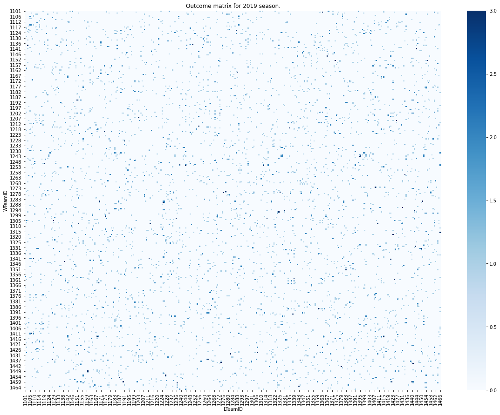

This week I have been exploring the data from the [March Machine Learning Mania 2021 - NCAAM](https://www.kaggle.com/c/ncaam-march-mania-2021) Kaggle competition.
One of the nice things about a Kaggle competition is that they host all of the competition data for you. 
If we are careful, we can take advantage of this to make our project repository shareable and easy to use without needing to include the data in our git repository.
This is great because GitHub has a file size limit and will complain if we try to track larger data files.

I have built a minimal [example repository](https://github.com/sethchart/HeatmapNCAA) where you can test the procedure that I outline below and make a basic heatmap of regular season wins.

## Excluding Data from Git
The first thing we will want to do is make a folder called `data` in our project folder.
This is where we will keep all of the competition data. 
To make sure that data files are not included in git version control we need to exclude the data folder from git by including the following lines at the bottom of our `.gitignore` file.
```
# Exclude the data folder from version control
data/**
```
If you don't have a `.gitignore` file in your project folder, just use your favorite test editor to add it and include the lines above.

## Installing the Kaggle API
To use the Kaggle API to download data, you will need to install the kaggle package with the command below
```
pip install kaggle
```

In the provided notebook, I have included the `kaggle` package in my requirements.txt file, so you can ensure that everything you need to run the notebook is installed by running the line below.
```python
!pip install -r requirements.txt
```

## Getting the Data

In order to access the data that I used for this post you will need to join the Kaggle competition [here](https://www.kaggle.com/account/login?returnUrl=%2Fc%2Fncaam-march-mania-2021%2Frules). 
Then you will need to get your Kaggle API token by following the instructions [here](https://www.kaggle.com/docs/api).
In the provided notebook, I will use the CLI tool to get the data, which assumes that you have the `kaggle.json` file saved as described in the instructions.

Once your Kaggle credentials are set up and you have joined the competition, you can download and decompress all of the data to the data folder using the following two lines in the provided notebook.

```python 
!kaggle competitions download -c ncaam-march-mania-2021 -p data
!unzip -f data/ncaam-march-mania-2021.zip -d data
```

## Conclusion

By taking advantage of the Kaggle API and including the data download procedure in our repository, we are able to avoid tracking data in our repository, while still making our repository easy to use for others.
